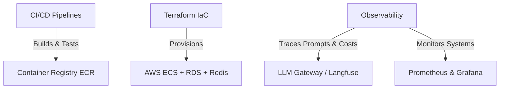

# Full-Stack Agentic AI DevOps & AWS Deployment Guide

This guide details the DevOps roadmap, AWS architecture choices, and Infrastructure as Code (IaC) templates using Terraform and GitHub Actions.

---

## 1. DevOps Pillars for Agentic AI Full-Stack App

To make your project stand out for DevOps roles, you must treat the "AI" aspect as a first-class citizen alongside the frontend/backend. Here are the core DevOps components:



### A. CI/CD (Continuous Integration / Continuous Deployment)
*   **Static Code Analysis**: Automated Python linting (Flake8/Black) and React typescript validation (`tsc` & ESLint).
*   **Automated Testing**: Executing `pytest` for FastAPI and `vitest` for the React dashboard.
*   **Dockerization**: Multi-stage Docker builds compiled, tagged, and pushed to Amazon ECR.
*   **GitOps Delivery**: Auto-deploying changes upon git push to `main` by updating ECS Task Definitions.

### B. Infrastructure as Code (IaC)
*   All AWS resources (VPC, Load Balancers, Databases, Container Tasks) declared declaratively using **Terraform**.

### C. Observability & Monitoring (Specific to Agentic AI)
Traditional CRUD apps monitor CPU and memory. Agentic AI apps require **LLM Observability**:
*   **LLM Tracing**: Integrating **Langfuse** or **OpenLLMetry** (OpenTelemetry wrapper) to trace agent decisions. This logs how the Coordinator Agent resolved conflicts, what prompt version was used, the latency of Groq/OpenAI calls, and total token usage (costs).
*   **Business KPI Alerts**: Exposing metrics endpoints (via Prometheus FastAPI Instrumentator) for Grafana to track stockout rates, simulator health, and agent errors.

---

## 2. AWS Architecture Options for Your Project

AWS provides three primary options for hosting this FastAPI + React + PostgreSQL + Redis architecture:

| Choice | Architecture | Pros | Cons | Best For |
| :--- | :--- | :--- | :--- | :--- |
| **Option 1: ECS Fargate** *(Recommended)* | Serverless Docker containers managed by ECS. Fronted by Application Load Balancer (ALB). PostgreSQL hosted in RDS; Redis in ElastiCache. | • Zero EC2 server management<br>• Scalable and highly secure<br>• Isolated VPC networks | • Slightly higher base cost due to ALB (~$20/mo) | Standard production environments |
| **Option 2: EC2 + Docker Compose** | Single EC2 Virtual Machine running Docker Engine and `docker-compose`. | • Extremely cheap ($5-$10/mo)<br>• Identical to your local setup | • Single point of failure<br>• Manual OS patch management | Initial staging / personal portfolios |
| **Option 3: AWS EKS (Kubernetes)** | Managed Kubernetes cluster deploying Pods and Services. | • Industry-standard for large-scale microservices | • Over-engineered for 2 services<br>• Expensive base cost (~$70/mo cluster fee) | Enterprise scale |

---

## 3. Production Infrastructure as Code (Terraform)

Create a directory named `terraform` in the root of the project:
```bash
mkdir terraform
```

Write the following script into `terraform/main.tf` to provision the **Option 1 (ECS Fargate)** serverless architecture on AWS.

```hcl
# terraform/main.tf

terraform {
  required_version = ">= 1.3.0"
  required_providers {
    aws = {
      source  = "hashicorp/aws"
      version = "~> 5.0"
    }
  }
}

provider "aws" {
  region = var.aws_region
}

# ================= VPC & Network =================
resource "aws_vpc" "main" {
  cidr_block           = "10.0.0.0/16"
  enable_dns_hostnames = true
  tags = { Name = "supply-chain-vpc" }
}

resource "aws_subnet" "public_a" {
  vpc_id            = aws_vpc.main.id
  cidr_block        = "10.0.1.0/24"
  availability_zone = "${var.aws_region}a"
  map_public_ip_on_launch = true
}

resource "aws_subnet" "public_b" {
  vpc_id            = aws_vpc.main.id
  cidr_block        = "10.0.2.0/24"
  availability_zone = "${var.aws_region}b"
  map_public_ip_on_launch = true
}

resource "aws_internet_gateway" "gw" {
  vpc_id = aws_vpc.main.id
}

resource "aws_route_table" "public" {
  vpc_id = aws_vpc.main.id
  route {
    cidr_block = "0.0.0.0/0"
    gateway_id = aws_internet_gateway.gw.id
  }
}

resource "aws_route_table_association" "a" {
  subnet_id      = aws_subnet.public_a.id
  route_table_id = aws_route_table.public.id
}

resource "aws_route_table_association" "b" {
  subnet_id      = aws_subnet.public_b.id
  route_table_id = aws_route_table.public.id
}

# ================= Security Groups =================
resource "aws_security_group" "alb" {
  name   = "supply-chain-alb-sg"
  vpc_id = aws_vpc.main.id

  ingress {
    from_port   = 80
    to_port     = 80
    protocol    = "tcp"
    cidr_blocks = ["0.0.0.0/0"]
  }

  egress {
    from_port   = 0
    to_port     = 0
    protocol    = "-1"
    cidr_blocks = ["0.0.0.0/0"]
  }
}

resource "aws_security_group" "ecs_tasks" {
  name   = "supply-chain-ecs-tasks-sg"
  vpc_id = aws_vpc.main.id

  ingress {
    from_port       = 0
    to_port         = 0
    protocol        = "-1"
    security_groups = [aws_security_group.alb.id]
  }

  egress {
    from_port   = 0
    to_port     = 0
    protocol    = "-1"
    cidr_blocks = ["0.0.0.0/0"]
  }
}

# ================= Database (RDS Postgres) =================
resource "aws_db_subnet_group" "db" {
  name       = "supply-chain-db-subnet"
  subnet_ids = [aws_subnet.public_a.id, aws_subnet.public_b.id]
}

resource "aws_security_group" "db" {
  name   = "supply-chain-db-sg"
  vpc_id = aws_vpc.main.id

  ingress {
    from_port       = 5432
    to_port         = 5432
    protocol        = "tcp"
    security_groups = [aws_security_group.ecs_tasks.id]
  }
}

resource "aws_db_instance" "postgres" {
  allocated_storage      = 20
  engine                 = "postgres"
  engine_version         = "15.4"
  instance_class         = "db.t4g.micro"
  db_name                = "supply_chain"
  username               = "postgres"
  password               = var.db_password
  db_subnet_group_name   = aws_db_subnet_group.db.name
  vpc_security_group_ids = [aws_security_group.db.id]
  skip_final_snapshot    = true
}

# ================= Application Load Balancer =================
resource "aws_lb" "main" {
  name               = "supply-chain-alb"
  internal           = false
  load_balancer_type = "application"
  security_groups    = [aws_security_group.alb.id]
  subnets            = [aws_subnet.public_a.id, aws_subnet.public_b.id]
}

resource "aws_lb_target_group" "frontend" {
  name        = "tg-frontend"
  port        = 80
  protocol    = "HTTP"
  vpc_id      = aws_vpc.main.id
  target_type = "ip"
  
  health_check {
    path = "/"
    port = "80"
  }
}

resource "aws_lb_listener" "http" {
  load_balancer_arn = aws_lb.main.arn
  port              = "80"
  protocol          = "HTTP"

  default_action {
    type             = "forward"
    target_group_arn = aws_lb_target_group.frontend.arn
  }
}

# ================= ECS Cluster & Service =================
resource "aws_ecs_cluster" "main" {
  name = "supply-chain-cluster"
}

resource "aws_ecs_task_definition" "app" {
  family                   = "supply-chain-app"
  network_mode             = "awsvpc"
  requires_compatibilities = ["FARGATE"]
  cpu                      = "512"
  memory                   = "1024"
  execution_role_arn       = aws_iam_role.ecs_execution.arn
  task_role_arn            = aws_iam_role.ecs_task.arn

  container_definitions = jsonencode([
    {
      name      = "backend"
      image     = "${var.backend_image_url}:latest"
      cpu       = 256
      memory    = 512
      essential = true
      portMappings = [
        {
          containerPort = 8000
          hostPort      = 8000
        }
      ]
      environment = [
        { name = "DATABASE_URL", value = "postgresql+asyncpg://${aws_db_instance.postgres.username}:${var.db_password}@${aws_db_instance.postgres.endpoint}/${aws_db_instance.postgres.db_name}" },
        { name = "ENVIRONMENT", value = "production" },
        { name = "MONGODB_URI", value = var.mongodb_uri },
        { name = "GROQ_API_KEY", value = var.groq_api_key },
        { name = "USE_LLM_AGENTS", value = "true" }
      ]
    },
    {
      name      = "frontend"
      image     = "${var.frontend_image_url}:latest"
      cpu       = 256
      memory    = 512
      essential = true
      portMappings = [
        {
          containerPort = 80
          hostPort      = 80
        }
      ]
    }
  ])
}

resource "aws_ecs_service" "app_service" {
  name            = "supply-chain-service"
  cluster         = aws_ecs_cluster.main.id
  task_definition = aws_ecs_task_definition.app.arn
  desired_count   = 1
  launch_type     = "FARGATE"

  network_configuration {
    subnets          = [aws_subnet.public_a.id, aws_subnet.public_b.id]
    security_groups  = [aws_security_group.ecs_tasks.id]
    assign_public_ip = true
  }

  load_balancer {
    target_group_arn = aws_lb_target_group.frontend.arn
    container_name   = "frontend"
    container_port   = 80
  }
}

# ================= IAM Roles =================
resource "aws_iam_role" "ecs_execution" {
  name = "supply-chain-ecs-execution-role"
  assume_role_policy = jsonencode({
    Version = "2012-10-17"
    Statement = [{
      Action    = "sts:AssumeRole"
      Effect    = "Allow"
      Principal = { Service = "ecs-tasks.amazonaws.com" }
    }]
  })
}

resource "aws_iam_role_policy_attachment" "ecs_execution" {
  role       = aws_iam_role.ecs_execution.name
  policy_arn = "arn:aws:iam::aws:policy/service-role/AmazonECSTaskExecutionRolePolicy"
}

resource "aws_iam_role" "ecs_task" {
  name = "supply-chain-ecs-task-role"
  assume_role_policy = jsonencode({
    Version = "2012-10-17"
    Statement = [{
      Action    = "sts:AssumeRole"
      Effect    = "Allow"
      Principal = { Service = "ecs-tasks.amazonaws.com" }
    }]
  })
}
```

Write configuration variables to `terraform/variables.tf`:

```hcl
# terraform/variables.tf

variable "aws_region" {
  type    = string
  default = "us-east-1"
}

variable "db_password" {
  type      = string
  sensitive = true
}

variable "mongodb_uri" {
  type      = string
  sensitive = true
}

variable "groq_api_key" {
  type      = string
  sensitive = true
}

variable "backend_image_url" {
  type = string
}

variable "frontend_image_url" {
  type = string
}
```

---

## 4. Production CI/CD Pipeline (GitHub Actions)

Create this workflow at `.github/workflows/deploy.yml` to automatically compile your code, verify tests, build Docker containers, push them to AWS ECR, and update the ECS task definition.

```yaml
# .github/workflows/deploy.yml
name: Production CI/CD Pipeline

on:
  push:
    branches: [ main ]

jobs:
  test:
    runs-on: ubuntu-latest
    steps:
    - uses: actions/checkout@v3

    # Backend Pytest Verification
    - name: Set up Python 3.13
      uses: actions/setup-python@v4
      with:
        python-version: "3.13"
    - name: Install backend dependencies
      run: |
        python -m pip install --upgrade pip
        pip install -r backend/requirements.txt
    - name: Run Backend Tests
      run: |
        cd backend
        python -m pytest

    # Frontend Build Verification
    - name: Set up Node.js
      uses: actions/setup-node@v3
      with:
        node-version: 20
    - name: Build Frontend
      run: |
        cd frontend
        npm ci
        npm run build

  deploy:
    needs: test
    runs-on: ubuntu-latest
    steps:
    - uses: actions/checkout@v3

    # Configure AWS credentials
    - name: Configure AWS credentials
      uses: aws-actions/configure-aws-credentials@v1
      with:
        aws-access-key-id: ${{ secrets.AWS_ACCESS_KEY_ID }}
        aws-secret-access-key: ${{ secrets.AWS_SECRET_ACCESS_KEY }}
        aws-region: us-east-1

    - name: Login to Amazon ECR
      id: login-ecr
      uses: aws-actions/amazon-ecr-login@v1

    # Build and Push Backend
    - name: Build, tag, and push Backend Image
      env:
        ECR_REGISTRY: ${{ steps.login-ecr.outputs.registry }}
      run: |
        docker build -t $ECR_REGISTRY/supply-chain-backend:latest -f docker/Dockerfile.backend .
        docker push $ECR_REGISTRY/supply-chain-backend:latest

    # Build and Push Frontend
    - name: Build, tag, and push Frontend Image
      env:
        ECR_REGISTRY: ${{ steps.login-ecr.outputs.registry }}
      run: |
        docker build -t $ECR_REGISTRY/supply-chain-frontend:latest -f docker/Dockerfile.frontend .
        docker push $ECR_REGISTRY/supply-chain-frontend:latest

    # Update Amazon ECS Task Definition
    - name: Deploy to Amazon ECS
      run: |
        aws ecs update-service --cluster supply-chain-cluster --service supply-chain-service --force-new-deployment
```
